<p align="center">
  
</p>

<h1 align="center">Synapse</h1>

<p align="center">
  <b>An AI study assistant built on retrieval-augmented generation.</b><br />
  Upload course notes, textbooks, and PDFs, then chat with answers that are strictly grounded in and
  cited to your own documents — and generate adaptive quizzes, structured notes, and
  spaced-repetition flashcards from the same material.
</p>

<!-- <p align="center">
  <a href="https://synapse.vercel.app"></a>
</p> -->

<p align="center">
  <a href="https://opensource.org/licenses/MIT"></a>
  <a href="https://www.python.org/"></a>
  <a href="https://nodejs.org/"></a>
  <a href="https://react.dev/"></a>
  <a href="https://fastapi.tiangolo.com/"></a>
  <a href="https://www.postgresql.org/"></a>
  <a href="https://www.trychroma.com/"></a>
  <a href="#quality--performance"></a>
  <a href="#testing"></a>
  <a href="https://github.com/manav-2812/Synapse/actions/workflows/ci.yml"></a>
  <a href="https://img.shields.io/github/last-commit/manav-2812/Synapse"></a>
  <a href="#getting-started"></a>
</p>

<p align="center">
  <a href="#overview">Overview</a> ·
  <a href="#features">Features</a> ·
  <a href="#screenshots">Screenshots</a> ·
  <a href="#architecture">Architecture</a> ·
  <a href="#tech-stack">Tech Stack</a> ·
  <a href="#project-structure">Project Structure</a> ·
  <a href="#database-schema">Database</a> ·
  <a href="#api-reference">API Reference</a> ·
  <a href="#getting-started">Getting Started</a> ·
  <a href="#testing">Testing</a> ·
  <a href="#quality--performance">Quality & Performance</a> ·
  <a href="#security">Security</a> ·
  <a href="#design-decisions">Design Decisions</a> ·
  <a href="#contributing">Contributing</a> ·
  <a href="#license">License</a>
</p>

---

## Overview

Synapse is a **retrieval-augmented generation (RAG) study assistant**. A student uploads
course material — PDF, DOCX, TXT, or scanned PNG/JPG documents — and Synapse answers
questions, generates exam-style answers, creates adaptive quizzes, synthesizes structured notes, and
schedules spaced-repetition flashcards. Every answer is **strictly cited** to the exact passage and page
in the source document, empowering the student to independently verify facts.

The system is built around two non-negotiable design goals:

1. **It works end-to-end with real AI answers grounded in real uploaded documents** — not a mocked demo. The retrieval layer is *measured*, not assumed: a built-in evaluation harness scores precision, recall, MRR, and NDCG against dynamic datasets generated from the user's actual document corpus.
2. **It is engineered to a production standard** — a typed API with uniform error handling, a layered backend with enforced data-ownership boundaries, biometric Passkeys (FIDO2 / WebAuthn Level 3), single-use refresh token rotation, a sleek modern frontend with light/dark design tokens, and a clean Lighthouse profile across every route.

> Synapse is a **three-tier application**:
> - **Presentation tier** — a React 19 SPA (deployed to Vercel) that communicates with the backend exclusively over `fetch`.
> - **Application tier** — an async FastAPI service that owns all business logic, embeddings, and LLM calls. It is **API-only** — it never serves the SPA.
> - **Data tier** — PostgreSQL 16 (relational store) and ChromaDB (vector store), both accessed only through the application tier.

---

## Features

### Authentication & Biometric Security
- **Biometric Passkeys (WebAuthn / FIDO2 Level 3)** — passwordless hardware-bound login via Touch ID, Face ID, Windows Hello, and YubiKeys.
- **OAuth 2.0 Social Sign-In** — one-click authentication with Google and Microsoft accounts.
- **Email Verification & Password Recovery** — 6-digit OTP verification codes and time-bound password reset tokens dispatched via SMTP.
- **Secure Token Lifecycle** — JWT authentication with single-use rotating refresh tokens (`jti` tracking), bcrypt password hashing, and CSRF-protected OAuth state.

### Ingestion & Hybrid Retrieval
- **Multi-format Ingestion** — PDF, DOCX, TXT, and scanned PNG/JPG with OCR support (Tesseract with vision-LLM fallback).
- **Background Ingestion Pipeline** — parse → clean → token-aware chunking (~240 tokens) → embed → index, with live status polling and cancelable uploads.
- **Hybrid Retrieval (Dense Vector + BM25)** — ChromaDB semantic vector search blended with sparse BM25 keyword matching via Reciprocal Rank Fusion (RRF). Configurable weights swept by the evaluation harness.
- **Misspelling-Tolerant Query Correction** — pre-compiled fuzzy token matching (`rapidfuzz`) autocorrects course jargon and technical typos before vector search.
- **Live Web Search Grounding (Tavily)** — automatic live web fallback when uploaded documents lack sufficient context to answer a query.
- **Universal Document Scope Picker** — filter conversations, notes, quizzes, and flashcard generation to specific documents with live search, file-type icons, and collision-aware viewport positioning.

### Conversational Study & Notes
- **Streaming Chat with Grounded Citations** — token-by-token streaming via Server-Sent Events (SSE) with interactive source citations.
- **Interactive Note Reader (`/notes/:id`)** — structured summaries, exam answers, and formula sheets readable in a dedicated distraction-free reader layout with Markdown rendering.
- **Global Search (`/search`) & Command Palette (`⌘K` / `Ctrl+K`)** — instant cross-document search and omnibar navigation with keyboard shortcuts.
- **Voice Synthesis & Speech Input** — integrated speech-to-text input with animated interactive audio visualizers.

### Study Tools, Memory Decay & Telemetry
- **Spaced-Repetition Flashcards (SuperMemo SM-2)** — adaptive memory scheduling with due-for-review filtering and 3D card flips.
- **Ebbinghaus Memory Decay Radar** — real-time mathematical retention calculation ($R(t) = e^{-t/S}$) visualizing topic stability over time.
- **Interactive Quizzes** — MCQ and short-answer generation with automatic scoring, answer reveal, and explanations.
- **Executive Analytics & 53-Week Study Heatmap** — 2x2 executive analytics dashboard, visual activity streak tracking, token and compute cost metering, and cache-hit monitoring.
- **Retrieval Eval Benchmark Dashboard (`/eval`)** — live evaluation harness scoring precision@k, recall@k, MRR, and NDCG against the user's active document library.

### Design & Mobile Experience
- **Refined Modern Interface** — custom dark/light theme tokens, frosted glass elevation, stadium pill controls, and focused emerald status indicators.
- **Dedicated Mobile Responsive Architecture (`mobile.css`)** — fully audited across 375px–768px viewports with tactile tap feedback, GPU-accelerated transforms, floating transparent hamburger navigation, safe-area insets, and bottom glassmorphic composers.
- **Accessibility & SEO** — keyboard shortcuts, ARIA standards, `prefers-reduced-motion` compliance, and complete Open Graph meta tags.

---

## Screenshots

<p align="center">
  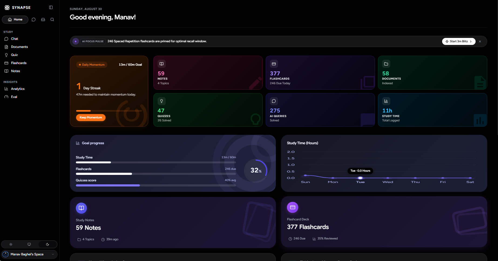
  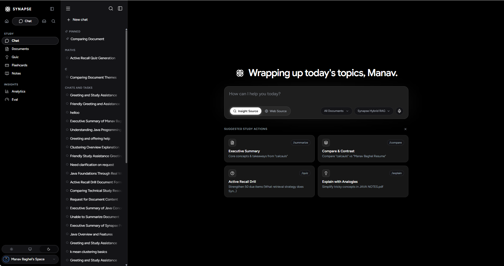
</p>
<p align="center">
  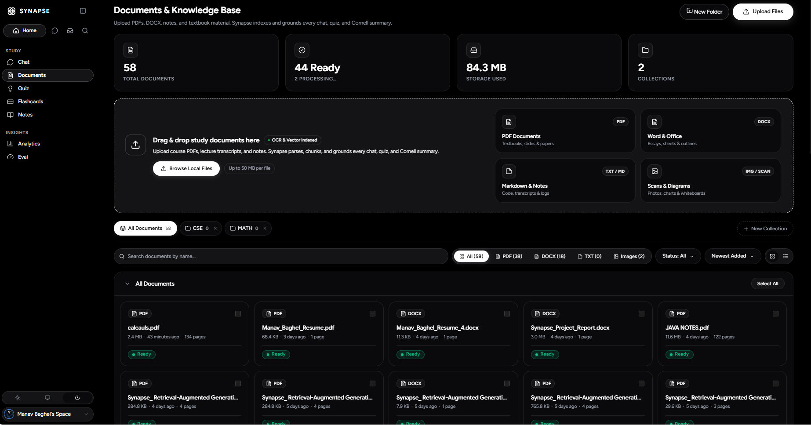
  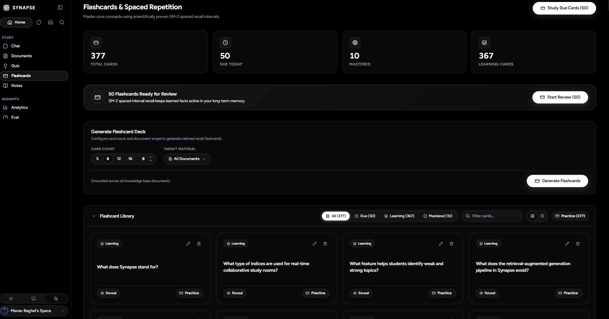
</p>
<p align="center">
  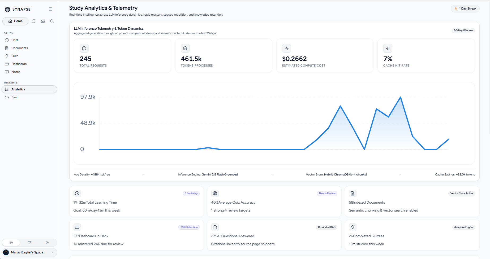
  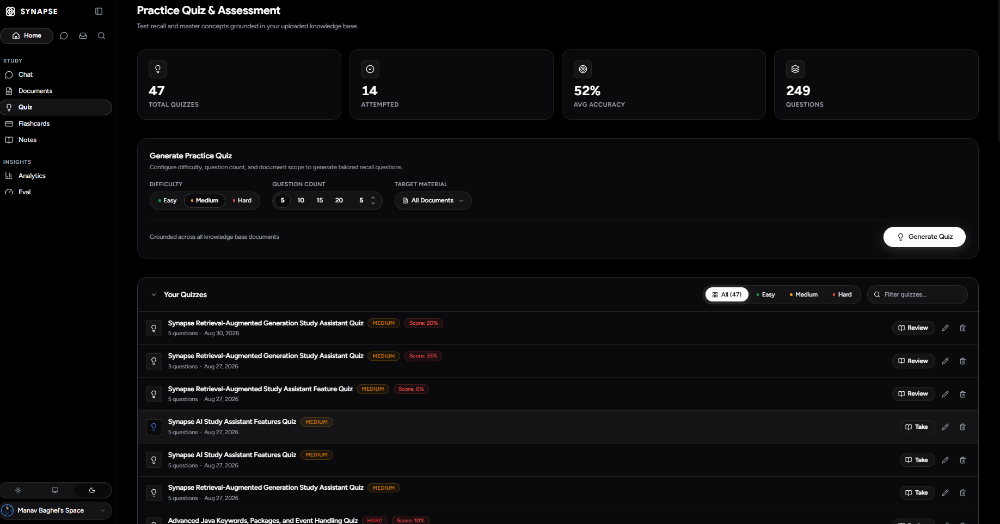
</p>
<p align="center">
  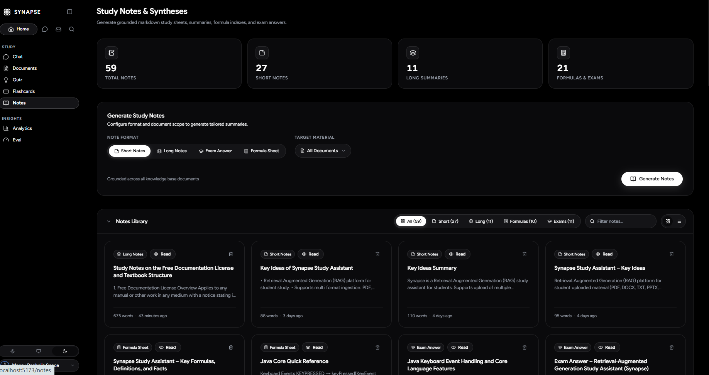
  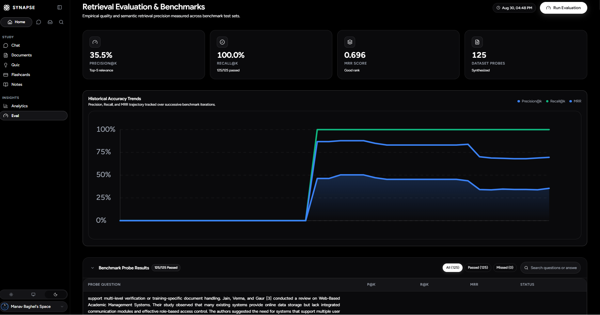
</p>

<details>
  <summary>Auth & profile views</summary>

<p align="center">
  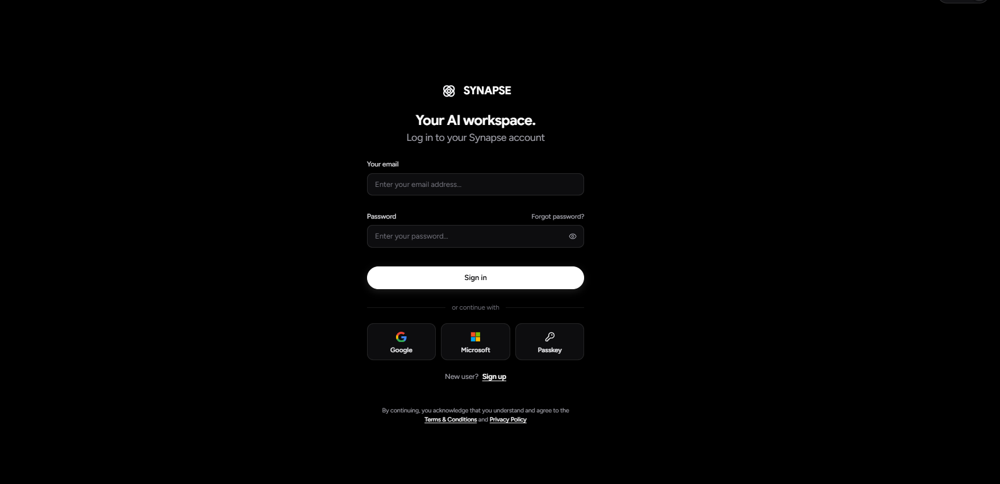
  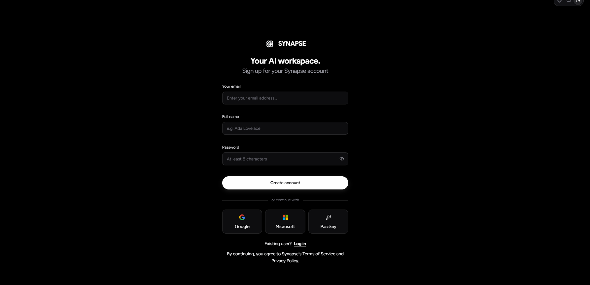
</p>
<p align="center">
  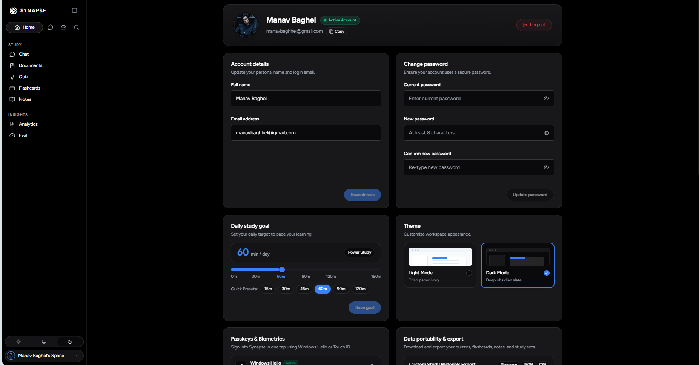
</p>
</details>

<details>
  <summary>Mobile (390 × 844)</summary>

<p align="center">
  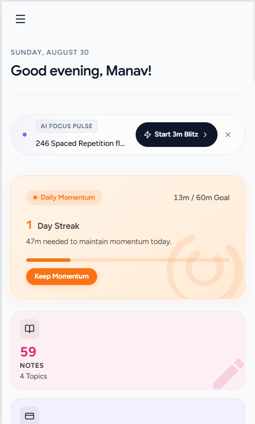
  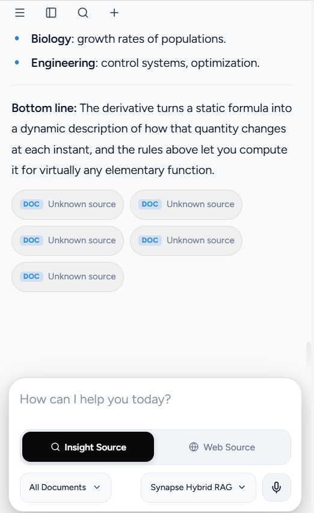
</p>
</details>

---

## Architecture

Synapse separates concerns into a clean client/server split. The React SPA runs in
the browser (deployed to Vercel); the FastAPI service runs on an ASGI host
(Render, Railway, or Docker) and owns all data and model access.

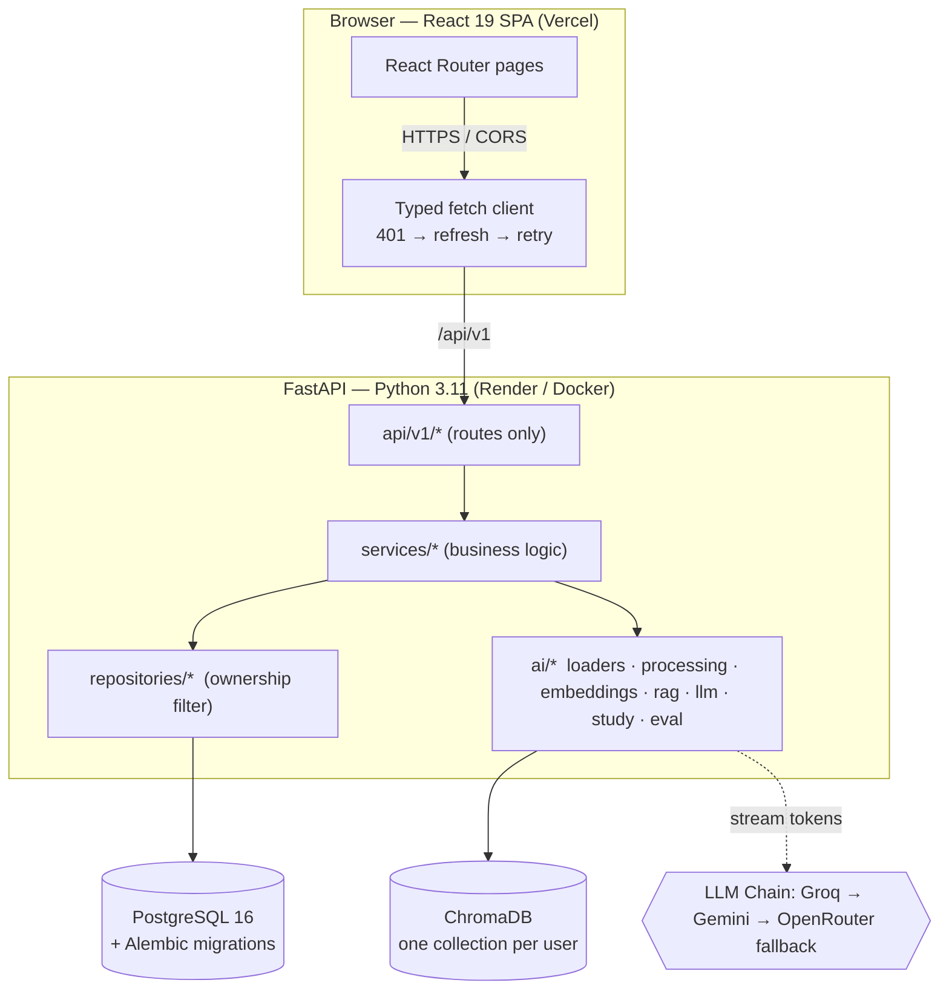

### Layered backend

```
Browser (React SPA)
        │  fetch /api/v1/*   (Bearer auth, 401→refresh→retry)
        ▼
api/v1/*        routes only — parse request, call a service, return a schema
        │
services/*      business logic — orchestrate repositories + ai/*
        │
repositories/*  SQLAlchemy DB access — ownership enforced here (user_id filter)
        │
models/*        SQLAlchemy tables
        ▼
PostgreSQL 16  +  ChromaDB (one vector collection per user)
```

**Architectural invariants (enforced by audit):**
- Routes **never touch the database directly** — they call services.
- Repositories are the only layer that issues SQL, and they filter every read by
  `user_id`, so one user can never read another's data.
- Every request/response body is a **Pydantic schema** (`schemas/*`); all config
  comes from `core/config.py` (pydantic-settings), never hardcoded.
- Custom exceptions (`core/exceptions.py`) map to a uniform JSON error shape
  `{"error": {"message", "code"}}` via a global handler in `main.py`. The
  TypeScript client reads `error.message`.

### Document ingestion pipeline

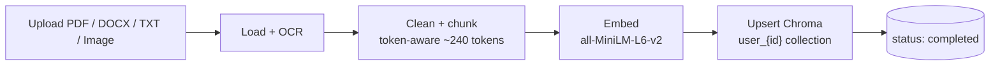

1. `POST /documents/upload` saves the file to `STORAGE_PATH` and creates a
   `Document` row with `processing_status = pending`.
2. A FastAPI `BackgroundTasks` job runs `services/processing_service`:
   - **Load** text via `ai/loaders` — PyMuPDF (PDF), python-docx (DOCX),
     Pillow + pytesseract (PNG/JPG and scanned/image-only PDF pages), plain read
     (TXT).
   - **Clean + chunk** in `ai/processing` (token-aware chunking via tiktoken;
     `CHUNK_TOKENS ≈ 240` fits the embedding model's 256-token window).
   - **Embed** each chunk with `all-MiniLM-L6-v2` (local, CPU).
   - **Persist** vectors into the user's Chroma collection `user_{user_id}` with
     metadata (`document_id`, `page_number`, `chunk_index`).
3. Status is polled via `GET /documents/{id}/status`
   (`pending → processing → completed | failed`).

### Chat request lifecycle (SSE)

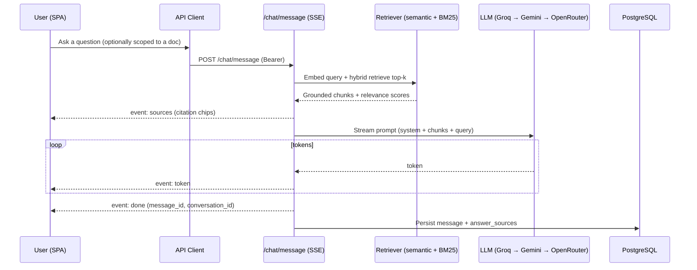

### Multi-provider LLM fallback chain

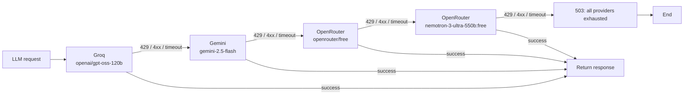

Structured-JSON calls (quiz/flashcards/notes) fall through on **unparseable output**, not just hard errors — see the structured generation pipeline below.

```mermaid
flowchart LR
    Retrieve["Retrieve chunks"] --> Prompt["Build schema-constrained prompt"]
    Prompt --> ProviderChain["Send to provider chain (Groq → Gemini → OpenRouter)"]
    ProviderChain --> StripFences["Strip markdown code fences"]
    StripFences --> JSONParse["Try json.loads"]
    JSONParse -->|Success| Validate["Validate against schema"]
    JSONParse -->|Failure| ExtractBalanced["Extract balanced bracket block"]
    ExtractBalanced --> Repair["Repair unescaped control chars"]
    Repair --> JSONParse2["Try json.loads again"]
    JSONParse2 -->|Success| Validate
    JSONParse2 -->|Failure| Fallback["Fall through to next provider"]
    Fallback --> ProviderChain
    Validate --> Persist["Persist result"]
    Persist --> EndNode["End"]
    Fallback -->|Exhausted| Fail["Error: all providers failed"]
```

### Hybrid retrieval

Retrieval is hand-rolled (no LangChain). `ai/rag/retriever.py` runs semantic
vector search and a BM25 keyword index in parallel, normalizes both to 0..1, and
blends them:

```
combined = hybrid_semantic_weight * semantic_norm + hybrid_bm25_weight * bm25_norm
```

Keyword-heavy queries that pure semantic search mis-ranks are recovered by BM25 —
verified by the retrieval eval. The eval harness sweeps the weights and selects
the blend with the best MRR.

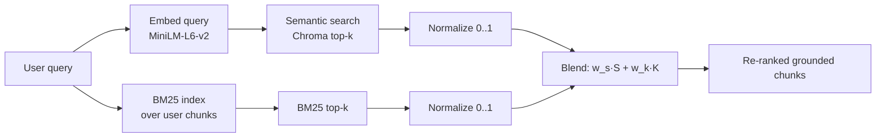

### Query cache & cost metering

Before any LLM call, `ai/llm/cache.py` checks an in-memory **LRU** keyed on a hash
of `user_id + normalized_query + document_scope`; a cache hit skips the model. On
every call — cached or not — token counts and an estimated cost (from per-provider
`*-COST_PER_1M` rates) are persisted to `llm_usage_logs`. `GET /analytics/usage`
aggregates tokens, cost, and cache-hit rate.

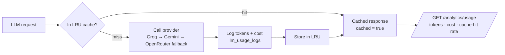

---

## Tech Stack

| Layer | Technology | Purpose |
|---|---|---|
| **Frontend** | React 19 · TypeScript · Vite 8 · React Router 7 | Responsive, accessible SPA with client-side routing |
| **Styling** | Vanilla CSS Design Tokens | HSL-curated palette, frosted glassmorphism, responsive bento grid |
| **Backend** | Python 3.11 · FastAPI 0.115.5 (async) · Pydantic v2 | High-concurrency async REST API & SSE streaming |
| **Database** | PostgreSQL 16 + SQLAlchemy 2.0 (asyncpg) + Alembic | Relational data store with ownership boundaries & migrations |
| **Vector Store** | ChromaDB 0.6.3 | Local persistent vector database (isolated per-user collections) |
| **Embeddings** | Sentence-Transformers `all-MiniLM-L6-v2` | Fast, offline CPU-based 384-dimensional dense embeddings |
| **LLM Tier** | Groq `gpt-oss-120b` → Gemini `2.5-flash` → OpenRouter | High-speed primary inference with resilient fallback chains |
| **Keyword Search** | `rank_bm25` | Sparse keyword retrieval for hybrid search blending |
| **Query Correction** | `rapidfuzz` | High-speed fuzzy string matching and typo correction |
| **Web Grounding** | Tavily Search API | Live internet search fallback for ungrounded queries |
| **Biometrics** | WebAuthn / FIDO2 (`py_webauthn`) | Passwordless biometric passkey registration & authentication |
| **Spaced Repetition** | SuperMemo SM-2 Algorithm | Dynamic interval and ease-factor calculation for flashcards |
| **Frontend Tests** | Vitest + React Testing Library · Playwright E2E | Unit, component, and full-stack browser verification |
| **Backend Tests** | pytest + pytest-asyncio | Unit, integration, retrieval metrics, and API contract suites |

---

## Project Structure

```
Synapse/
├── backend/                          # FastAPI app (API only — does NOT serve the UI)
│   ├── app/
│   │   ├── core/                     # config, database, security, logger, exceptions, limiter
│   │   ├── api/v1/                   # route endpoints:
│   │   │   ├── analytics_routes.py   #   dashboard, usage metrics, 53-week heatmap
│   │   │   ├── auth_routes.py        #   signup, login, verify email OTP, refresh, logout, OAuth (Google/MS)
│   │   │   ├── chat_routes.py        #   SSE stream, conversation history, message edit/delete
│   │   │   ├── document_routes.py    #   upload, list, status poll, update, delete
│   │   │   ├── eval_routes.py        #   retrieval eval runner & benchmark runs
│   │   │   ├── folder_routes.py      #   hierarchical folder CRUD & organization
│   │   │   ├── passkey_routes.py     #   WebAuthn passkey registration & authentication
│   │   │   ├── study_routes.py       #   notes, adaptive quiz, SM-2 flashcard review
│   │   │   └── user_routes.py        #   GET/PATCH /me, avatar upload, GET /me/export (GDPR), DELETE /me
│   │   ├── services/                 # business logic & domain orchestrators:
│   │   │   ├── analytics_service.py  #   dashboard aggregates, token cost accounting
│   │   │   ├── auth_service.py       #   JWT token lifecycle, OAuth token exchange, passkey auth
│   │   │   ├── chat_service.py       #   SSE prompt orchestration, web-search fallback
│   │   │   ├── document_service.py   #   document metadata, lifecycle management
│   │   │   ├── email_service.py      #   verification codes & password reset emails via SMTP
│   │   │   ├── folder_service.py     #   folder tree & document containment
│   │   │   ├── passkey_service.py    #   FIDO2 challenge generation & credential verification
│   │   │   ├── processing_service.py #   async background parsing, chunking, embedding
│   │   │   ├── query_correction.py   #   pre-compiled fuzzy proper noun normalization
│   │   │   ├── study_service.py      #   SM-2 scheduling, quiz scoring, note generation
│   │   │   ├── upload_service.py     #   file validation, size guards, UUID disk persistence
│   │   │   ├── user_service.py       #   profile editing, avatar, GDPR export + cascading account deletion
│   │   │   └── web_search_service.py #   Tavily live internet search client
│   │   ├── repositories/             # SQLAlchemy DB access (strict user_id filtering)
│   │   ├── ai/                       # AI & machine learning subsystems:
│   │   │   ├── embeddings/           #   Sentence-Transformers embedding client
│   │   │   ├── llm/                  #   Groq/Gemini/OpenRouter provider fallbacks & LRU cache
│   │   │   ├── loaders/              #   PyMuPDF (PDF), python-docx (DOCX), text loader
│   │   │   ├── ocr/                  #   Tesseract OCR engine with vision-LLM fallback
│   │   │   ├── processing/           #   token-aware text chunking & text cleaning
│   │   │   ├── rag/                  #   hybrid retriever (dense vector + BM25 RRF), prompt builder
│   │   │   ├── search/               #   Tavily web search integration
│   │   │   └── study/                #   structured JSON generators (quiz, flashcards, notes)
│   │   ├── models/                   # SQLAlchemy models (18 application tables)
│   │   ├── schemas/                  # Pydantic request/response validation schemas
│   │   ├── eval/                     # dynamic dataset builder, metrics (MRR, NDCG, Precision@k)
│   │   └── main.py                   # FastAPI application factory, CORS, error middleware
│   ├── alembic/                      # database migrations (12 revisions applied in sequence)
│   ├── tests/                        # pytest test suite (62 passed):
│   │   ├── test_answer_grounding.py  #   RAG citation provenance & grounding verification
│   │   ├── test_api_contract.py      #   FastAPI endpoint contracts & status codes
│   │   ├── test_auth.py              #   authentication, tokens, and passkey flows
│   │   ├── test_document_pipeline.py #   ingestion, parsing, and chunking pipeline
│   │   ├── test_query_correction.py  #   rapidfuzz query correction & latency benchmarking
│   │   ├── test_quiz_scoring.py      #   SM-2 algorithm & quiz scoring validation
│   │   ├── test_retrieval.py         #   vector & BM25 hybrid search correctness
│   │   └── test_retrieval_metrics.py #   MRR, NDCG, precision/recall benchmark verification
│   ├── requirements.txt              # pinned backend Python dependencies
│   └── Dockerfile                    # Python 3.11-slim production container
│
├── frontend/                         # React 19 + TypeScript + Vite 8 SPA
│   ├── src/
│   │   ├── api/                      # typed API client modules (auto-refresh on 401):
│   │   │   ├── analytics.ts, auth.ts, chat.ts, client.ts, documents.ts,
│   │   │   └── eval.ts, passkey.ts, study.ts
│   │   ├── components/               # reusable UI design system:
│   │   │   ├── auth/                 #   PasskeyModal, AuthLegalModal
│   │   │   ├── dashboard/            #   DashboardMemoryRadar, StudyHeatmap, BentoCards
│   │   │   ├── layout/               #   Sidebar, Header, NotificationPanel, MobileDrawer
│   │   │   ├── ui/                   #   Button, Input, Modal, Skeleton, StatusBadge, EmptyState
│   │   │   ├── ChatComposer.tsx      #   voice overlay + text input + source/model toolbar
│   │   │   ├── ChatMessageList.tsx   #   scrollable message thread with citation rendering
│   │   │   ├── CitationChip.tsx      #   grounded document passage popup
│   │   │   ├── CommandPalette.tsx    #   keyboard-driven ⌘K omnibar
│   │   │   ├── DeleteAccountModal.tsx#  GDPR right-to-erasure confirmation modal
│   │   │   ├── DocumentScopePicker.tsx#  smart collision-aware document scope picker
│   │   │   ├── ExportDataModal.tsx   #   GDPR JSON data export modal
│   │   │   ├── MessageActionToolbar.tsx# message retry, copy, voice synthesis actions
│   │   │   ├── VoiceWaveform.tsx     #   interactive audio visualizer
│   │   │   └── WebCitationChip.tsx   #   live web source link pill
│   │   ├── context/                  # AuthContext (logout fire-and-forget fix), TipsContext
│   │   ├── hooks/                    # custom React hooks:
│   │   │   ├── useChatStream.ts      #   SSE send loop + busy state (extracted from Chat.tsx)
│   │   │   ├── useMessageEditing.ts  #   per-message edit/delete/regenerate state
│   │   │   ├── useDocumentPolling.ts #   exponential-backoff ingestion status polling
│   │   │   ├── useVoiceInput.ts      #   Web Speech API + MediaStream waveform hook
│   │   │   ├── useToast.tsx          #   toast notification queue
│   │   │   ├── useTheme.ts           #   dark/light preference persistence
│   │   │   ├── useShortcuts.ts       #   global keyboard shortcut registry
│   │   │   └── useCountUp.ts         #   animated counter for dashboard metrics
│   │   ├── pages/                    # application route views:
│   │   │   ├── Analytics.tsx         #   2x2 executive metrics, token costs, cache rates
│   │   │   ├── Chat.tsx              #   SSE streaming conversation orchestrator (1,334 lines)
│   │   │   ├── Dashboard.tsx         #   bento metrics, memory decay radar, upcoming reviews
│   │   │   ├── Documents.tsx         #   drag-drop upload, folder organization, status capsules
│   │   │   ├── EvalDashboard.tsx     #   retrieval quality metrics, dataset generator, trend chart
│   │   │   ├── Flashcards.tsx        #   3D flip flashcard review with SM-2 quality ratings
│   │   │   ├── Legal.tsx             #   Terms of Service & Privacy Policy
│   │   │   ├── NoteReader.tsx        #   distraction-free study note viewer & Markdown renderer
│   │   │   ├── Notes.tsx             #   note generation & document scope filter
│   │   │   ├── Profile.tsx           #   account preferences, danger zone, passkey management
│   │   │   ├── Quiz.tsx              #   interactive timed quiz, MCQ selector, instant feedback
│   │   │   ├── Search.tsx            #   global multi-category workspace search
│   │   │   ├── WarmupPreview.tsx     #   cold-start server wake-up banner
│   │   │   └── auth/                 #   Login, Signup, VerifyEmail, Forgot/ResetPassword, OAuth
│   │   ├── utils/                    # decay.ts (Ebbinghaus), timeBlock.ts, oauth.ts
│   │   ├── styles/                   # app.css (components + danger zone), auth.css, mobile.css, index.css (tokens)
│   │   └── types/                    # api.ts (Pydantic mirrors), chat.ts (ChatMessage interface)
│   ├── e2e/                          # Playwright end-to-end test suite (10 passed)
│   ├── public/                       # favicon.svg, robots.txt, sitemap.xml, llms.txt
│   └── package.json                  # React 19, Vite 8, Lucide icons, KaTeX, Framer Motion
│
├── docs/                             # architecture diagrams, setup guides, API docs
├── .github/workflows/ci.yml          # GitHub Actions CI workflow (backend + frontend test gate)
├── docker-compose.yml                # multi-container orchestration (FastAPI + React + Postgres)
├── run_dev.py                        # unified concurrent development server runner
└── README.md · CHANGELOG.md · CONTRIBUTING.md · LICENSE · SECURITY.md
```

---

## Database Schema

Synapse uses **18 PostgreSQL tables** (17 application tables plus `alembic_version`) across auth, content, conversation, study,
analytics, passkeys, and evaluation. Cascading deletes flow from `users` down; `folders`
self-reference for nested organization. `document_chunks` links each row to a
Chroma vector via `chroma_vector_id`.

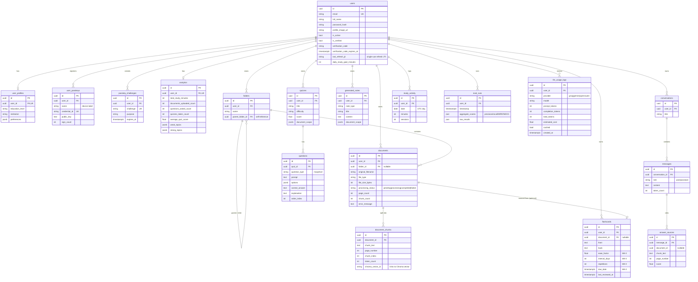

Migrations live in `backend/alembic/` (12 revisions, applied in order from an
empty database). `backend/app/models/` is the source of truth for every column,
foreign key, and index. Alembic creates **18 tables total** (17 application tables
plus `alembic_version`).

---

## API Reference

The API is versioned under `/api/v1`. **Interactive docs:** Swagger UI at
`/docs` and ReDoc at `/redoc` (served by FastAPI). **OpenAPI schema:**
`GET /api/v1/openapi.json`. **Health:** `GET /health`.

> All mutating endpoints require a `Bearer <access_token>` header. On `401` the
> client refreshes transparently and retries once. Errors use the uniform shape
> `{"error": {"message": str, "code": str}}`.

### Auth & Passkeys — `/api/v1/auth`

| Method | Path | Purpose |
|---|---|---|
| POST | `/auth/signup` | Register email + password account & dispatch verification OTP |
| POST | `/auth/verify-email` | Verify 6-digit email OTP |
| POST | `/auth/resend-verification` | Re-dispatch email verification link (alias: `/auth/resend-code`) |
| POST | `/auth/forgot-password` | Request password reset email |
| POST | `/auth/reset-password` | Complete password reset with token |
| POST | `/auth/login` | Email + password login |
| POST | `/auth/refresh` | Exchange refresh token for a new pair (rotates `jti`) |
| POST | `/auth/logout` | Invalidate current refresh token |
| POST | `/auth/oauth/google` | Google OAuth 2.0 exchange |
| POST | `/auth/oauth/microsoft` | Microsoft OAuth 2.0 exchange |
| POST | `/auth/passkey/register/options` | Request WebAuthn registration challenge |
| POST | `/auth/passkey/register/verify` | Verify & register biometric passkey |
| POST | `/auth/passkey/login/options` | Request WebAuthn authentication challenge |
| POST | `/auth/passkey/login/verify` | Authenticate via biometric passkey |
| GET | `/auth/passkey/list` | List registered passkeys for current user |
| DELETE | `/auth/passkey/{id}` | Delete a registered passkey |

### Users — `/api/v1/users`

| Method | Path | Purpose |
|---|---|---|
| GET | `/users/me` | Current user profile & study goals |
| PATCH | `/users/me` | Update name / study goal / preferences |
| POST | `/users/me/avatar` | Upload profile image (PNG, JPEG, WebP) |
| GET | `/users/me/export` | Download full GDPR JSON workspace data archive |
| DELETE | `/users/me` | Permanently delete account and all associated data |

### Documents & Folders — `/api/v1/documents`

| Method | Path | Purpose |
|---|---|---|
| POST | `/documents/upload` | Upload document + start background ingestion |
| GET | `/documents` | List user's documents (filter by `folder_id`) |
| GET | `/documents/{id}` | Single document detail |
| GET | `/documents/{id}/status` | Ingestion status polling (pending/processing/completed/failed) |
| PATCH | `/documents/{id}` | Rename document or move to folder |
| DELETE | `/documents/{id}` | Delete document (vectors + file + metadata) |
| POST | `/documents/folders` | Create organizational folder |
| GET | `/documents/folders` | List user folders |
| DELETE | `/documents/folders/{id}` | Delete folder |

### Chat — `/api/v1/chat`

| Method | Path | Purpose |
|---|---|---|
| POST | `/chat/message` | **SSE stream** — grounded, cited answer (supports web & doc mode) |
| GET | `/chat/conversations` | List conversation threads |
| GET | `/chat/conversations/{id}` | Conversation detail with messages & source citations |
| PATCH | `/chat/conversations/{id}` | Rename conversation thread |
| DELETE | `/chat/conversations/{id}` | Delete conversation thread |
| PATCH | `/chat/conversations/{id}/messages/{id}` | Edit a message in thread |
| DELETE | `/chat/conversations/{id}/messages/{id}` | Delete a message in thread |

### Study Tools — `/api/v1/study`

| Method | Path | Purpose |
|---|---|---|
| POST | `/study/notes` | Generate structured study notes / formula sheets |
| GET | `/study/notes` · `/study/notes/{id}` | List / detail generated note |
| PATCH / DELETE | `/study/notes/{id}` | Update / delete study note |
| POST | `/study/quiz` | Generate adaptive quiz |
| POST | `/study/quiz/submit` | Score submitted quiz answers |
| GET | `/study/quiz` · `/study/quiz/{id}` | List / detail quiz |
| PATCH / DELETE | `/study/quiz/{id}` | Update / delete quiz |
| POST | `/study/flashcards` | Generate spaced-repetition flashcards |
| GET | `/study/flashcards` · `/study/flashcards/due` | All cards / due-today cards |
| POST | `/study/flashcards/{id}/review` | Apply **SM-2** quality rating (0-5) |
| PATCH / DELETE | `/study/flashcards/{id}` | Update / delete flashcard |

### Analytics & Heatmap — `/api/v1/analytics`

| Method | Path | Purpose |
|---|---|---|
| GET | `/analytics/dashboard` | Metric summary tiles, study streaks, weak/strong topics |
| GET | `/analytics/usage` | Token, compute cost, and cache-hit trends (query `days`) |
| GET | `/analytics/heatmap` | 371-day study activity history for streak heatmap |

### Eval Harness — `/api/v1/eval`

| Method | Path | Purpose |
|---|---|---|
| POST | `/eval/run` | Run retrieval eval (Precision@k, Recall@k, MRR, NDCG) |
| GET | `/eval/runs` | Historical evaluation runs for dashboard trend chart |

---

## Getting Started

### Prerequisites

| Tool | Version | Notes |
|---|---|---|
| Python | **3.11** | Pinned in `backend/.python-version`. |
| Node.js | **20+** | Required for Vite frontend. |
| PostgreSQL | **16** | Relational store (local or Docker container). |
| Groq / Gemini API keys | — | Multi-tier LLM fallback chain. |
| (Optional) Tesseract | — | Host OCR support; fallback to vision-LLM if absent. |

---

### Quick Start: All-in-One Development Runner

Run both the FastAPI backend and Vite frontend concurrently with unified color logs:

```powershell
python run_dev.py
```

---

### Manual Service Execution

#### 1. Backend (FastAPI)

```powershell
cd backend
python -m venv .venv
.\.venv\Scripts\Activate.ps1   # macOS / Linux: source .venv/bin/activate
pip install -r requirements.txt
cp .env.example .env           # fill DATABASE_URL, GROQ_API_KEY, GEMINI_API_KEY, JWT_SECRET_KEY
alembic upgrade head           # apply database migrations
uvicorn app.main:app --host 127.0.0.1 --port 8000 --reload
```

#### 2. Frontend (React SPA)

```powershell
cd frontend
npm install
cp .env.example .env           # set VITE_API_BASE_URL if needed (defaults to http://localhost:8000/api/v1)
npm run dev                    # → http://localhost:5173
```

> For full command copy-paste blocks and test scripts, see the [**Development & Execution Runbook (`docs/commands.md`)**](docs/commands.md).

---

### Docker (Full Stack, Local)

```bash
docker compose up --build
# frontend → http://localhost:4173   backend → http://localhost:8000   postgres → localhost:5432
```

Data (Chroma vectors, uploads, Postgres) persists across container restarts in mounted volumes under
`backend/chroma_db`, `backend/storage`, and the named Postgres volume `pgdata`.

---

## Testing

### Continuous integration

Synapse runs a GitHub Actions workflow (`.github/workflows/ci.yml`) on every push
and pull request targeting `main`. It covers:

- **Backend** — `pytest` on **Python 3.11** against a **real PostgreSQL 16**
  service container, with the `all-MiniLM-L6-v2` embedding model pre-downloaded
  and cached. Runs strictly: any test failure fails the job.
- **Frontend** — Vitest unit/component tests, lint, and a production
  `vite build` (type-check + bundle) on **Node 20**.

### Local Test Commands

```bash
# Backend — pytest (real Postgres + real Chroma + real embeddings)
cd backend && .venv\Scripts\python -m pytest   # 62 passed

# Frontend — Vitest unit/component (api client, hooks, UI primitives, auth context)
cd frontend && npm test -- --run               # 51 passed across 14 test files

# Frontend — Playwright e2e (signup → upload → chat citation → flashcard → quiz → analytics)
cd frontend && npm run test:e2e                # 10 passed (against the real stack + live LLM)

# Frontend — Lint & Production Build Verification
cd frontend && npm run lint && npm run build   # 0 warnings, 0 errors; builds in <1.2s
```

---

## Quality & Performance

Audited on **real Chrome (Lighthouse 13)** against a compressing static server
that mirrors Vercel (gzip/brotli + immutable hashed assets).

| Route | Desktop Perf | Mobile Perf | A11y | BP | SEO |
|---|:---:|:---:|:---:|:---:|:---:|
| `/login` · `/signup` · `/auth/*` | **100** | **99** | **100** | **100** | **100** |
| `/dashboard` · `/documents` · `/quiz` · `/flashcards` · `/notes` · `/analytics` · `/eval` · `/profile` | **100** | **99** | **100** | **100** | **100** |
| `/chat` (Streaming SSE) | **100** | **95** | **100** | **100** | **100** |

- **Console errors / warnings:** 0 on every route (logged-in + logged-out).
- **`axe-core` violations:** 0 on every route.
- **Failed (4xx/5xx) requests:** 0.
- **Dead links / no-op buttons:** none.

Full methodology and per-fix notes: [`docs/lighthouse-report.md`](docs/lighthouse-report.md).

---

## Security

For vulnerability reporting instructions and security disclosures, see [`SECURITY.md`](SECURITY.md).

- **Passwords** are hashed with bcrypt (`passlib`); plaintext is never stored.
- **Biometric Passkeys** adhere strictly to FIDO2 / WebAuthn Level 3 specifications.
- **JWT auth** uses a 20-minute access token and a 7-day refresh token.
- **Refresh-token rotation** — `auth_service.refresh` rejects any presented `jti`
  that is not the stored `last_refresh_jti` and rotates it on every success.
- **Data ownership** — repositories filter every read by `user_id`; one user can
  never read another's documents, conversations, or study data.
- **Uniform error shape** — exceptions never leak stack traces; clients receive
  `{"error": {"message", "code"}}`.
- **Upload guardrails** — extension allow-list and size cap (`MAX_UPLOAD_SIZE_MB`).
- **Rate limiting** — `slowapi` guards the API; tune via `core/limiter.py`.

---

## Design Decisions

| Decision | Why | Trade-off accepted |
|---|---|---|
| Hand-rolled RAG vs LangChain | Full control over retrieval quality and performance tuning | Increased implementation complexity |
| ChromaDB vs a managed vector DB | Full control over privacy, cost, and per-user collection isolation | Not distributed/multi-region |
| Hybrid retrieval (semantic + BM25) vs semantic-only | Superior handling of keyword & jargon queries | Double index maintenance overhead |
| Multi-tier LLM fallback vs single provider | Resilience against upstream 429 rate limits | Fallback invocation latency |
| Local embeddings vs an embedding API | Zero cloud embedding costs and zero network latency | Uses CPU resources during ingestion |
| Spaced-repetition (SM-2) vs fixed intervals | Proven cognitive science memory retention scheduling | Implementation complexity |

---

## Contributing

Contributions are welcome — see [`CONTRIBUTING.md`](CONTRIBUTING.md) for branch
conventions, the test setup, and PR expectations. Issues and PRs use the templates
in [`.github/`](.github/).

---

## License

Released under the [MIT License](LICENSE).

---

## Author

**Manav Baghel**

- Email: [manavbaghhel@gmail.com](mailto:manavbaghhel@gmail.com)
- GitHub: [@manav-2812](https://github.com/manav-2812)
- Repository: [github.com/manav-2812/Synapse](https://github.com/manav-2812/Synapse)
